# System Architecture - Domain Diagrams

## 1. Authentication & User Domain

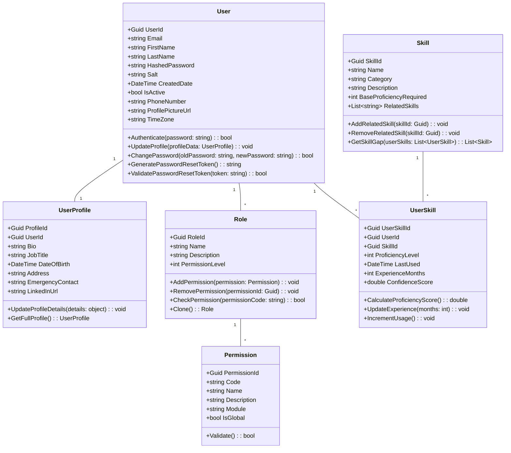

---

## 2. Department & Organization Domain

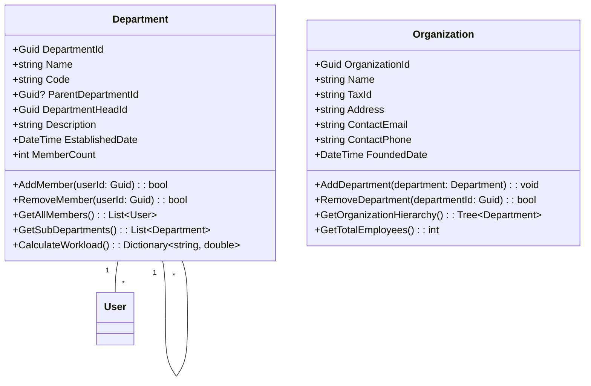

---

## 3. Project Management Domain

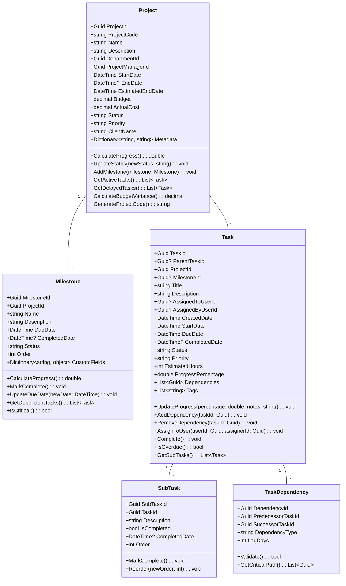

---

## 4. AI & ML Domain
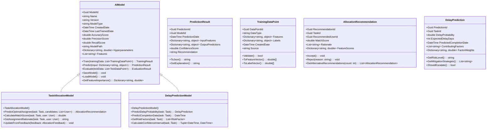
---

## 5. Notification Domain

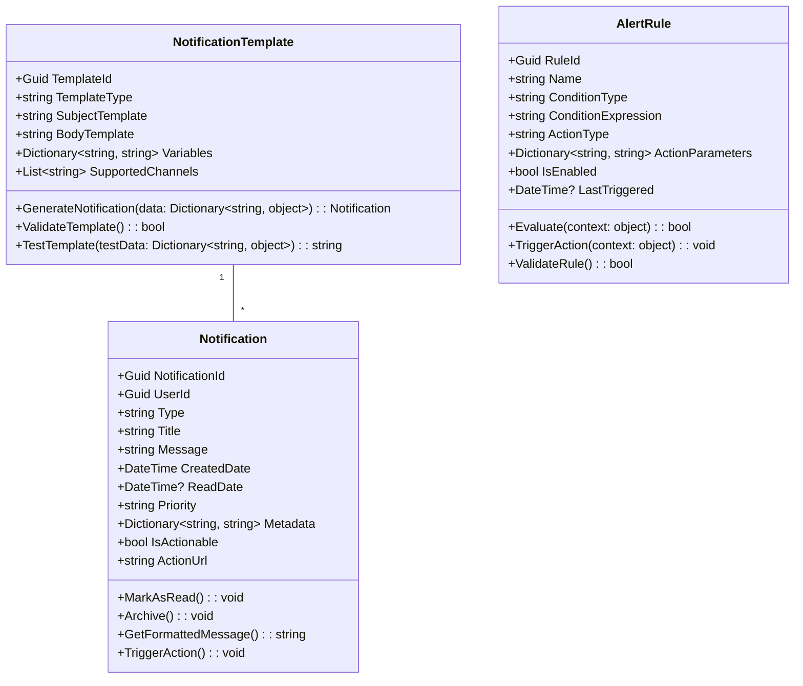

---

## 6. Analytics & Reporting Domain

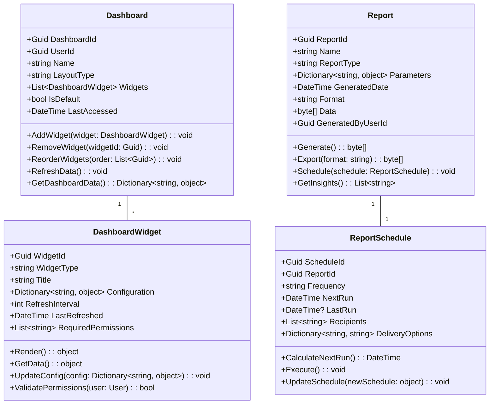

---

## 7. Integration Domain

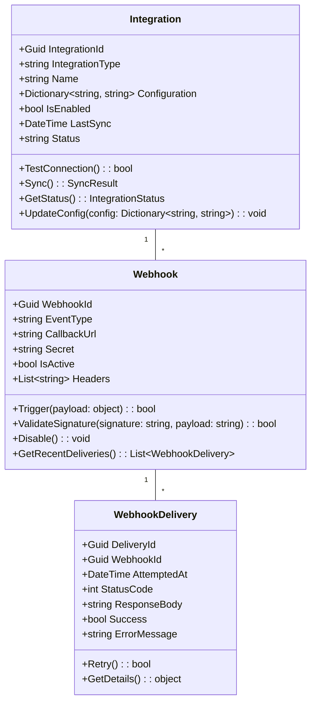

---

## 8. Knowledge Management Domain

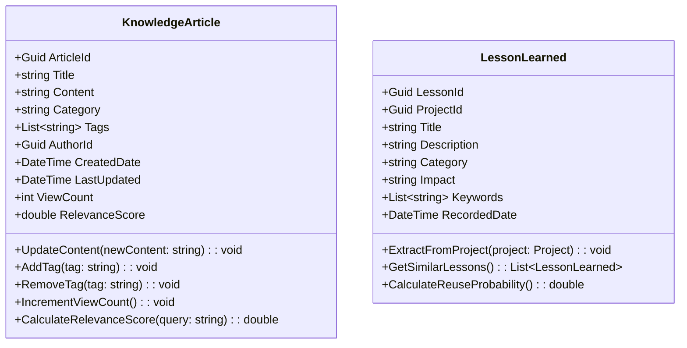

---

## 9. Audit & Logging Domain

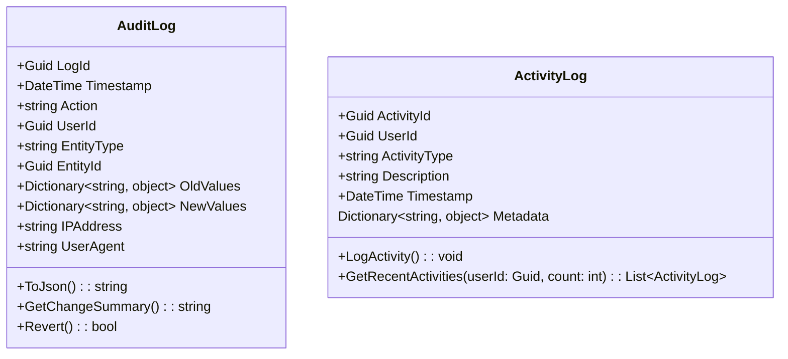

---
## 10. Service Layer

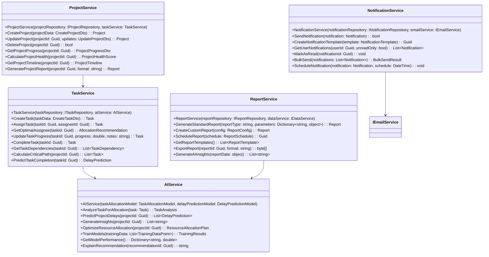

--- 

## 11. Interfaces

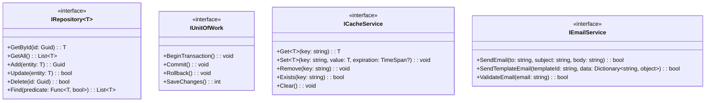